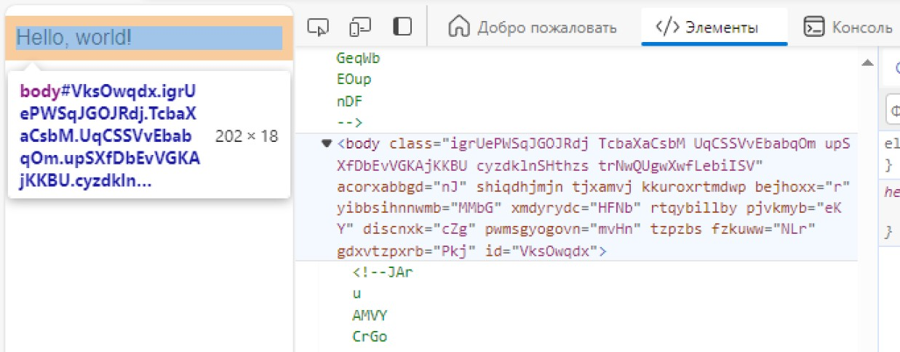

# 🛢 HTML Guard
When you add the static module `html-guard.js` it will automatically obfuscate the page layout. Protect your web application/site.

⚙️📄 __Makes it possible to use dynamic loading of resources using built-in functions, which prevents static downloading of styles and scripts.__

Briefly about the functions of HTML Guard:
 * 🛡 Obfuscation of HTML (auto)
 * 🛡🛠 Dynamic adding of CSS/JS (requires setup)
 * 🛡🛠 Protected attributes via prefix `_`
 * 🛡 Blocking DevTools in any browsers
 * 🛡 Lock the context menu
 * 🛡 Block dragging from a page
 * 🛡 Block text selection on a page
 * 🛡 Block console output



## 🔧 Add it to your site
```html
<!DOCTYPE  html>
<html>
    <head>
        <!-- Site protection ON! -->
        <script src="https://raw.githubusercontent.com/DosX-dev/HTML-Guard/main/html-guard.min.js"></script>
        <script>
            // Configure protection & resource loading
        </script>
    </head>

    <body>
    </body>
</html>
```

## ✅ Configure

### 🔒⚙️🔴 Safe style/script adding protection (recommended)
Avoid using `<link>`. Dynamically load .css and .js files! This method makes it possible to bypass downloaders of sites such as [web2zip.com](https://web2zip.com/). Dynamic addition of site resources makes it impossible to copy them during static analysis.
And in this case, when HTML Guard is removed from the dependencies, the contents of the web application will not be able to load for obvious reasons.

```html
<script>
    // ADDING: Add link to 'style.css'
    HtmlGuard.loader.loadStyleByRef("styles.css");
</script>
```

```html
<script>
    // ADDING: Add script "test.js" to head
    HtmlGuard.loader.loadScriptBySrc("test.js");

    //  OR

    // ADDING: Add script "test.js" to head after document loading
    HtmlGuard.loader.loadScriptBySrc_ContentLoaded("test.js");
</script>
```

### 🔒🖼🔴 Dynamic attributes protection (recommended)

Add `_` prefix before any attribute so that, `src` becomes `_src`. HTML Guard will automatically load this element

This protection method has 2 advantages:
 * Pictures and other resources will not be loaded through a static download of the site
 * Without HTML Guard attributes will not load

For example:
```html

```

### 🔒✨ Block Dev-Tools (recommended)
This function blocks any attempts to open developer tools and, if detected, reloads the page.
```html
<script>
    // PROTECTION: Disable DevTools
    HtmlGuard.protections.antiDevTools();
</script>
```

### 🔒 Disable context menu
Blocks the opening of the standard context menu.
```html
<script>
    // PROTECTION: Disable context menu
    HtmlGuard.protections.blockContextMenu();
</script>
```

### 🔒 Disable drag
The user will not be able to drag elements from the site.
```html
<script>
    // PROTECTION: Disable drag
    HtmlGuard.protections.blockDrag();
</script>
```

### 🔒 Disable selection
Removes the ability to use selection.
```html
<script>
    // PROTECTION: Disable selection
    HtmlGuard.protections.blockSelection();
</script>
```

### 🔒 Disable console output
This will be useful for hiding debug logs from the browser console. Hooks functions such as `log`, `debug`, `warn`, `error`, `dir`, `dirxml`, `assert`, `table` making them return __null__
```html
<script>
    // PROTECTION: Disable console output
    HtmlGuard.protections.blockConsoleOutput();
</script>
```

## 📄 Example of using
```html
<head>
<!-- Example of HTML-Guard protection -->

<!DOCTYPE html>
<html>

<head>
    <script src="../html-guard.js"></script>
    <script>
        // PROTECTION: Disable DevTools
        HtmlGuard.protections.antiDevTools();

        // PROTECTION: Disable context menu
        HtmlGuard.protections.blockContextMenu();

        // PROTECTION: Disable drag
        HtmlGuard.protections.blockDrag();

        // PROTECTION: Disable selection
        HtmlGuard.protections.blockSelection();

        // PROTECTION: Disable console output
        HtmlGuard.protections.blockConsoleOutput();

        // ADDING: Add link to 'style.css'
        HtmlGuard.loader.loadStyleByRef("styles.css");

        // ADDING: Run 'test.js' script
        HtmlGuard.loader.loadScriptBySrc("test.js");
    </script>
</head>

<body>
    <div>
        <!-- '_id' is protected variant of 'id' -->
        <p>Hello, world! Time: <span _id="time"></span></p>

        <!-- '_src' is protected variant of 'src' -->
        

    </div>

    <a _href="https://github.com/DosX-dev/HTML-Guard">HTML Guard in GitHub!</a>

</body>

</html>
```

## 📖 Note
This module is intended more for protecting web applications than for simple sites. If you are developing applications using frameworks like ReactJS, VueJS (and so on), then this project is perfect for you
